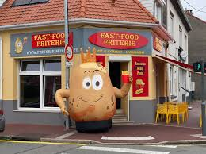
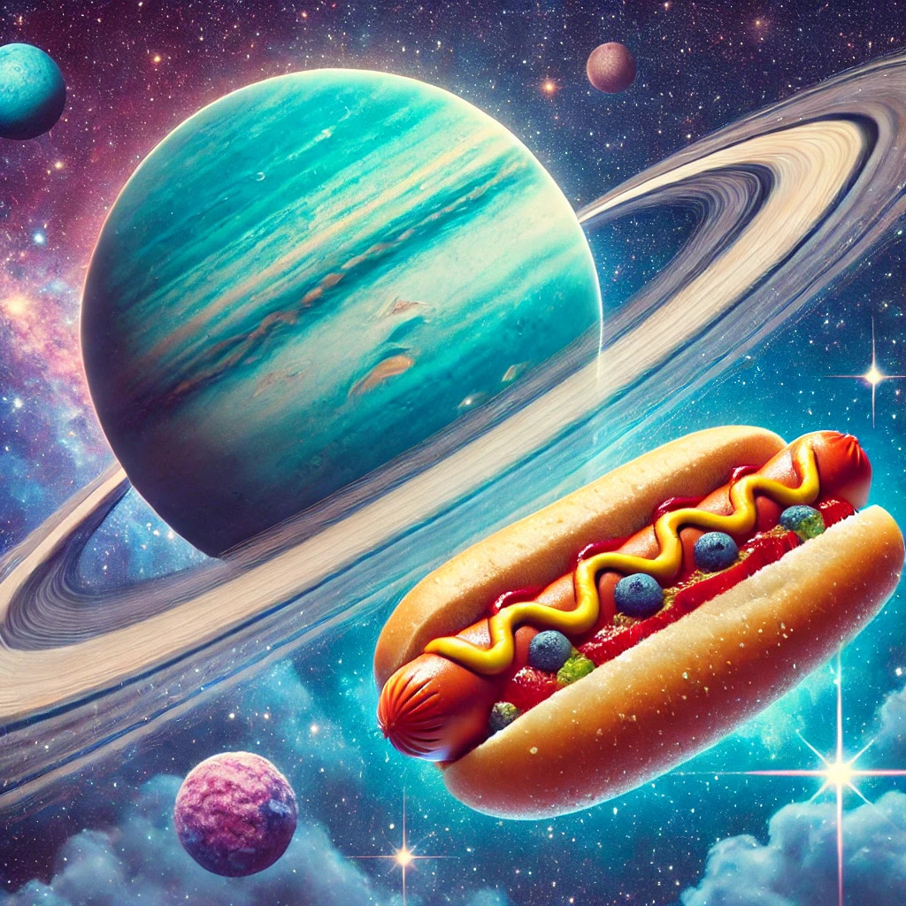

# Friterie Molien

**devant de la friterie :** !!!!

# Introduction

Lorem ipsum dolor sit amet, consectetur adipiscing elit. Pellentesque posuere, urna quis fermentum ornare, nibh neque porta sem, eu pretium odio justo a eros. Sed nisl dui, eleifend sit amet libero eu, condimentum lobortis risus. Pellentesque augue sem, gravida a aliquet imperdiet, consectetur id felis. Mauris dui mauris, facilisis pulvinar ligula quis, pulvinar hendrerit velit. Donec tincidunt odio sed nisi porta convallis. Suspendisse sodales augue vitae vestibulum varius. Cras bibendum posuere maximus. Duis non erat et leo tempor lobortis eget at lectus. Curabitur molestie bibendum semper. Suspendisse potenti. Sed nec pharetra lacus. Duis vitae commodo sem. Sed in consectetur libero, non iaculis ligula. Integer molestie malesuada massa a lobortis. Integer id eros leo. Nulla vestibulum libero sit amet dolor facilisis aliquam.

# Mais encore ...

Sed dignissim euismod pellentesque. Suspendisse placerat efficitur purus nec volutpat. Maecenas mattis metus quis sapien feugiat, nec pretium lorem accumsan. Praesent sed risus eu turpis auctor pharetra non eget eros. Quisque eu arcu et justo aliquet sodales id sit amet ante. Sed lacus ipsum, scelerisque eget felis quis, blandit fermentum augue. Fusce non ante molestie, fermentum odio a, luctus lectus. Cras non tristique felis. Praesent sed ligula dui.

# Et puis, mais bien sûr...

Vestibulum ante ipsum primis in faucibus orci luctus et ultrices posuere cubilia curae; In pulvinar, enim sit amet euismod interdum, dolor velit fringilla dui, non finibus lorem lectus vitae libero. Cras non commodo libero, a iaculis libero. Aliquam semper elit a sollicitudin eleifend. Nulla facilisi. Nulla accumsan viverra hendrerit. Donec sit amet vehicula eros. Donec porttitor turpis a magna tristique, vitae rutrum diam rhoncus. Proin vitae efficitur nulla.

# En résumé

Vestibulum laoreet leo urna, eu dictum odio pretium ut. Vivamus id erat faucibus, dictum quam vitae, sollicitudin odio. Etiam ut leo pellentesque, accumsan augue ut, malesuada mauris. Vivamus nisl enim, vehicula sit amet mollis sed, tincidunt quis lorem. Aliquam eu luctus justo, non lacinia sapien. Ut eget arcu id lectus aliquet mollis et a tellus. Duis id tempor nisi. Fusce vel orci ultricies, ornare diam nec, elementum orci.

# Alors sinon:

Nam eu vestibulum augue. Curabitur ornare risus vel nunc fringilla convallis. Cras consequat orci quis sagittis hendrerit. Morbi sit amet ex vel odio accumsan accumsan. Vestibulum porta a justo eget sollicitudin. Donec at lacus turpis. Nullam nunc mi, iaculis pulvinar felis et, convallis mollis dolor. Nulla suscipit, est ac feugiat ultrices, massa elit placerat elit, in efficitur massa neque porttitor mi. Cras vel diam nec nibh placerat congue vel sed velit. Cras tincidunt libero non orci ullamcorper aliquam. Aenean vitae purus a augue pellentesque dapibus eu a est.

# Les Hot-Dogs dans les Rizières sur Uranus

Lorsque l'on pense à la planète Uranus, des images de vastes étendues glacées et de mystérieuses tempêtes gazeuses viennent immédiatement à l'esprit. Cependant, il existe un phénomène plus surprenant encore : **les hot-dogs cultivés dans des rizières futuristes sur Uranus**. Oui, vous avez bien lu ! Cette planète éloignée abrite désormais des rizières expérimentales qui produisent des ingrédients essentiels pour l'élaboration de hot-dogs galactiques.

## Les Rizières sur Uranus : Un Miracle Technologique

Uranus, une planète géante gazeuse, possède une atmosphère inhospitalière, faite d'hydrogène, d'hélium et de méthane. Pourtant, grâce aux avancées technologiques des colonies interstellaires, des dômes de verre colossaux ont été construits pour cultiver du riz dans ce milieu hostile. Ces dômes maintiennent une atmosphère artificielle, idéale pour la culture du riz, un ingrédient clé des hot-dogs. 

Le riz uranien, plus robuste et riche en nutriments grâce aux conditions extrêmes de la planète, est devenu la base parfaite pour les petits pains des hot-dogs galactiques.

## Le Hot-Dog Uranien : Une Fusion Unique

Ce hot-dog spécial est bien plus qu'un simple en-cas. C'est le fruit de la collaboration entre les chercheurs culinaires et les agriculteurs interstellaires. 
