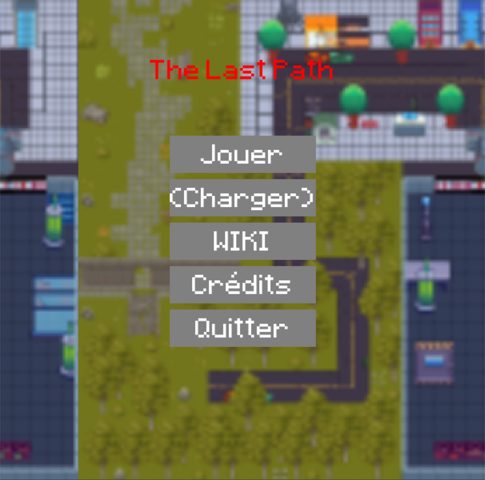
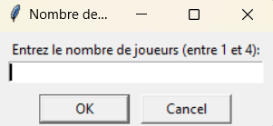
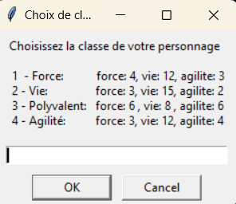
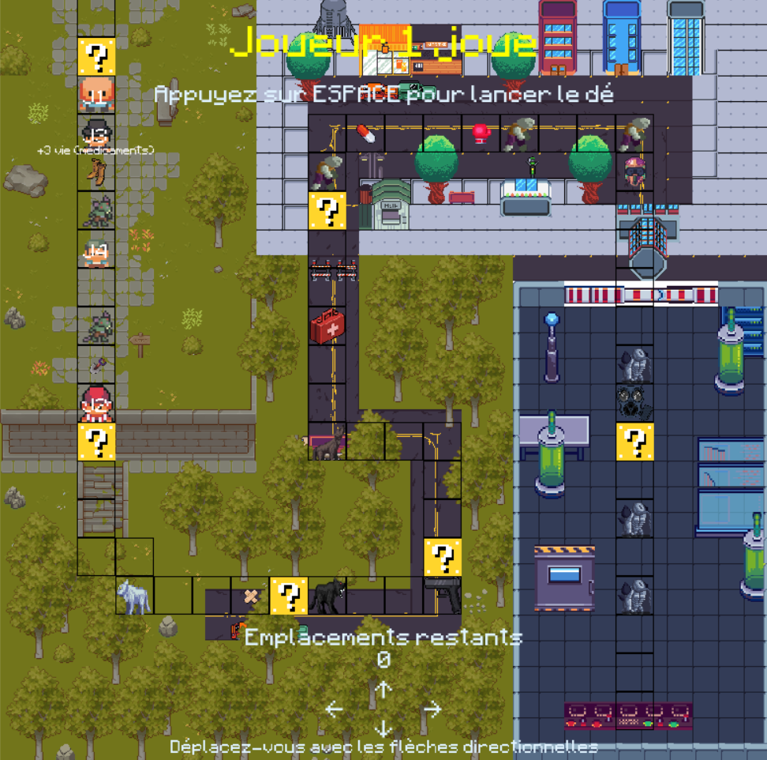
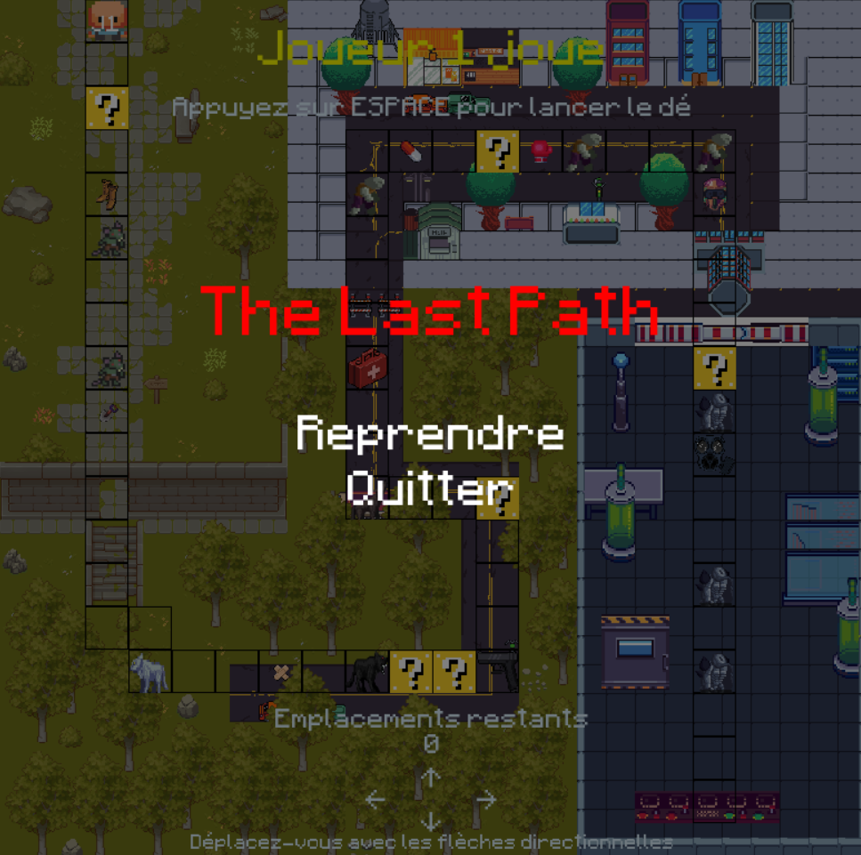
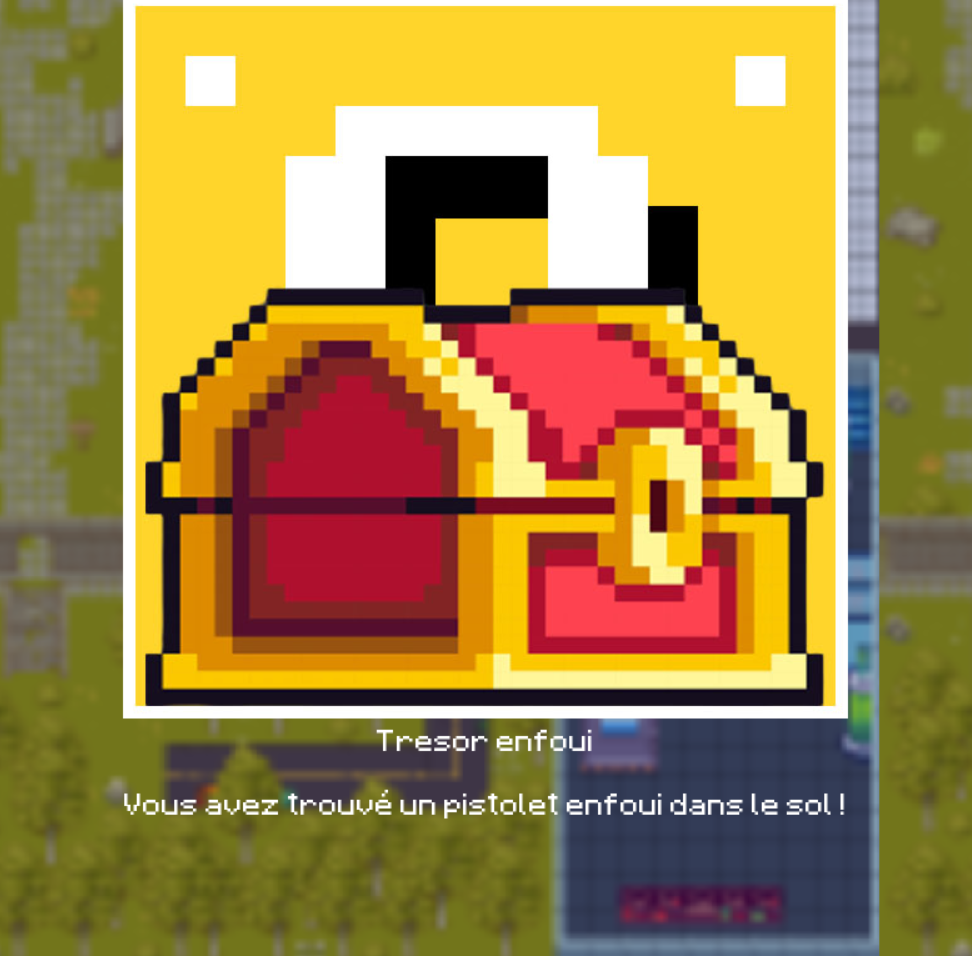
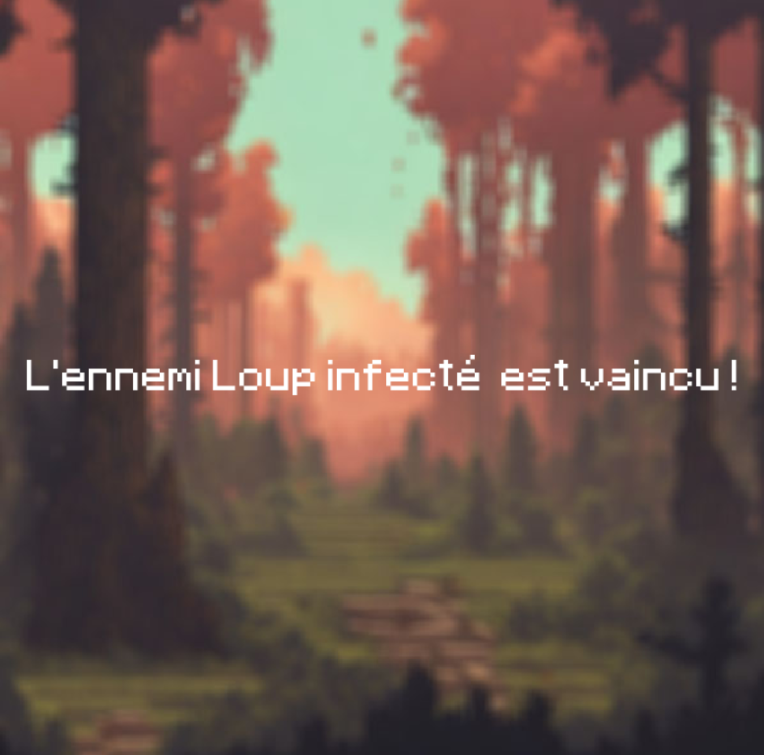
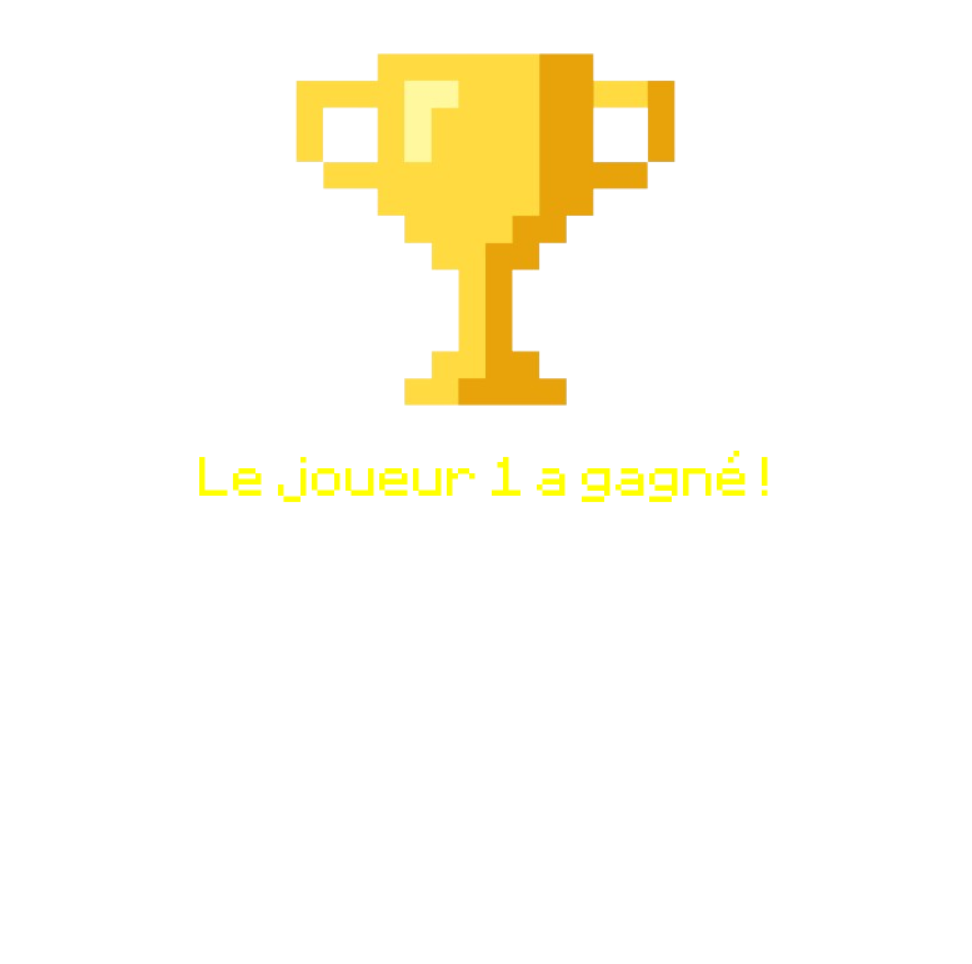

# Documentation Utilisateur Antoine DELRUE - JEU VIDEO

### Table des matières
- [Description du Jeu](#description-du-jeu)
- [Installation et Lancement Rapide](#installation-et-lancement-rapide)
- [Règles du Jeu](#règles-du-jeu)
  - [Système de Déplacement](#système-de-déplacement)
  - [Les Joueurs](#les-joueurs)
  - [Système de Combat](#système-de-combat)
- [Objet](#objet)
- [Environnements](#environnements)
- [Quête](#quête)
- [Différence de Parties](#différence-de-parties)
- [Description de l’interface](#description-de-linterface)
- [Illustration d’une partie](#illustration-dune-partie)

## Description du Jeu
Le jeu de plateau met en scène 4 personnages, chacun ayant les mêmes caractéristiques : force, vie et d’agilité, mais avec des statistiques différentes. Les joueurs se lancent dans une aventure où ils rencontrent des ennemis, des objets bonus et des événements aléatoires. Les déplacements et les combats sont résolus par un système de jets de dés, avec différentes attaques possibles. Le but ultime est d’atteindre le laboratoire pour accéder au vaccin.

## Installation et Lancement Rapide
1. **Prérequis** :
    - Assurez-vous d’avoir Python installé sur votre ordinateur.
2. **Téléchargement du ZIP** :
    - Téléchargez le ZIP à partir du lien du GIT.
3. **Extraction des Fichiers** :
    - Extrayez le contenu de l’archive dans un dossier de votre choix.
4. **Exécution du Jeu** :
    - Ouvrez un terminal ou une invite de commande.
    - Naviguez jusqu’au dossier où vous avez extrait les fichiers du jeu.
    - Exécutez le jeu en utilisant la commande suivante : `python menuMain.py` ou `python Main.py` pour seulement jouer au jeu.

## Règles du Jeu

### Système de Déplacement
Le joueur appuie sur la barre espace, une interface graphique lui indique la valeur du dé, puis il avance avec les flèches directionnelles, il peut même retourner en arrière.

### Les Joueurs
Le jeu comporte 4 personnages, chacun ayant des caractéristiques uniques :

1. Personnage 1 : Possède plus de force, inflige plus de dégâts mais moins agile.
    - Force: 4, Vie: 12, Agilite: 3

2. Personnage 2 : Possède plus de vie mais moins de force et moins d’agilité.
    - Force: 3, Vie: 15, Agilite: 2

3. Personnage 3 : Polyvalent et équilibré dans ses caractéristiques.
    - Force: 6, Vie: 8, Agilite: 6

4. Personnage 4 : Très agile, a une vie normale mais une faible force.
    - Force: 3, Vie: 12, Agilite: 4

Les joueurs sont neutres les uns par rapport aux autres, chacun joue de son côté.

### Système de Combat
Lorsqu’un joueur rencontre un ennemi sur une case, un combat est déclenché.
On demande au joueur le type d’attaque.
Il existe trois types d’attaque différents :

- **Attaque Normale** : Si l’attaque réussit, elle inflige des dégâts égaux à la valeur du dé.

- **Attaque Lente** : Si l’attaque réussit, elle inflige des dégâts égaux à la valeur du dé plus la force du joueur. Cependant, si l’ennemi obtient une meilleure valeur, les dégâts infligés sont la valeur du dé de l’ennemi moins l’agilité du joueur.

- **Attaque Rapide** : Si l’attaque réussit, elle inflige des dégâts égaux à la valeur du dé moins la force du joueur. En cas de meilleure valeur de l’ennemi, les dégâts infligés sont la valeur du dé de l’ennemi moins l’agilité du joueur.

#### Taper la 1ère lettre de l’attaque suffit (n, l, r) dans l’interface
Chacun tire un chiffre aléatoire entre 1 et 8.

#### Si la valeur du dé de l’ennemi est inférieure à celle du joueur, l’attaque réussit.
Si l’ennemi ou le joueur conserve des PV après l’attaque, un nouveau jet de dé a lieu.

Si le joueur gagne le combat, il conserve sa valeur actuelle de PV, même s’il n’a pas subi de dégâts. L’ennemi n’est pas éliminé, il est conservé pour les joueurs ultérieurs et revient à ses PV maximum.

Si le joueur perd le combat, il regagne tous ses PV et il revient à son dernier ennemi battu. S’il n’a pas battu d’ennemi, il revient au point de départ et il perd son objet s’il en possède un ou plusieurs.

## Objet
Il y a des objets présents sur le plateau, pour les obtenir il faut terminer son déplacement sur la case de l’objet. Revenir en arrière peut se montrer intéressant.

#### Voici la liste d’objet
1. **Bandage**
    - Bonus : +2 points de vie
2. **Trousse de soin**
    - Bonus : +4 points de vie
3. **Pistolet**
    - Bonus : +6 points de dégâts
4. **Gants de boxe**
    - Bonus : +2 points de dégâts
5. **Médicaments**
    - Bonus : +3 points de vie
6. **Pelle**
    - Bonus : +3 points de dégâts
7. **Masque à gaz**
    - Bonus : +2 points de défense
8. **Casque**
    - Bonus : +5 points de défense
9. **Grolles renforcées**
    - Bonus : +3 points de défense

## Environnements
Le jeu se déroule dans différents environnements :

- Campagne : Début du jeu, ennemis de la zone: Rat infecté.

- Forêt : 2ème zone du jeu, ennemis de la zone: Loup infecté.

- Ville abandonnée : 3ème zone du jeu, ennemis de la zone: Infecté.

- Laboratoire : Dernière zone du jeu, ennemis de la zone: Mutants.

## Quête
L’objectif final du jeu est de terminer le plateau dans le laboratoire pour accéder au vaccin.

## Différence de Parties
Pour rendre chaque partie unique, le jeu utilise des cartes aléatoires avec des effets positifs ou négatifs. L’emplacement de ces événements aléatoires varie d’une partie à l’autre. Pour activer un événement, il faut terminer son déplacement dessus. Parfois il peut être intéressant de revenir en arrière.

1. **Rencontre Amicale**
    - Description : Ajoute un objet aléatoire à la liste d’objets du joueur.

2. **Maladie**
    - Description : Enlève tous les objets du joueur et le fait perdre (revient à l’ennemi précédent si aucun ennemi n’a été battu, retour à la case de départ).

3. **Trésor Enfoui**
    - Description : Ajoute un pistolet à la liste d’objets du joueur.

4. **Vautour**
    - Description : Enlève tous les objets du joueur.

5. **Raccourci**
    - Description : Déplace le joueur sur une case aléatoire du chemin.

6. **Blessure**
    - Description : Enlève 4 points de vie au joueur.

## Description de l’interface

Une interface vous demande le nombre de joueurs, puis dans un second temps, les classes que les joueurs veulent choisir.

Le plateau est représenté par une image avec un chemin délimité, les joueurs sont dans les cases, les ennemis, les événements aléatoires et les objets également.

En haut de l’interface se trouve l’indication du joueur qui doit jouer, ainsi qu’un texte qui dit au joueur d’appuyer sur espace pour lancer le dé. À l’appui de la touche, une interface se lance.

Dans le bas de l’interface, le nombre de déplacements restants pour le joueur actuel est affiché, ainsi que des logos de flèches directionnelles et un message pour indiquer au joueur qu’il doit se déplacer en utilisant ces flèches.

Si le joueur appuie sur la touche Échap (Escape), le jeu se met en pause, et il faut cliquer sur “Reprendre” ou “Quitter”.

Il y a un indice sur le Joueur pour savoir s’il s’agit du joueur 1, 2, 3 ou 4.

Quand le joueur arrive au dernier déplacement sur un objet, un texte apparaît sur le personnage et l’objet disparaît du plateau, et pour un événement, une interface se lance de même pour la rencontre avec un ennemi.

Le joueur arrivé à la dernière case a gagné, ce qui lance une interface et met fin à la partie.

## Illustration d’une partie

# Quand on appuie sur Échap, le menu de pause s’affiche.

# Exemple quand on active un événement.

 

# Exemple quand on combat un ennemi.

 

# Exemple quand on fini la partie.

 