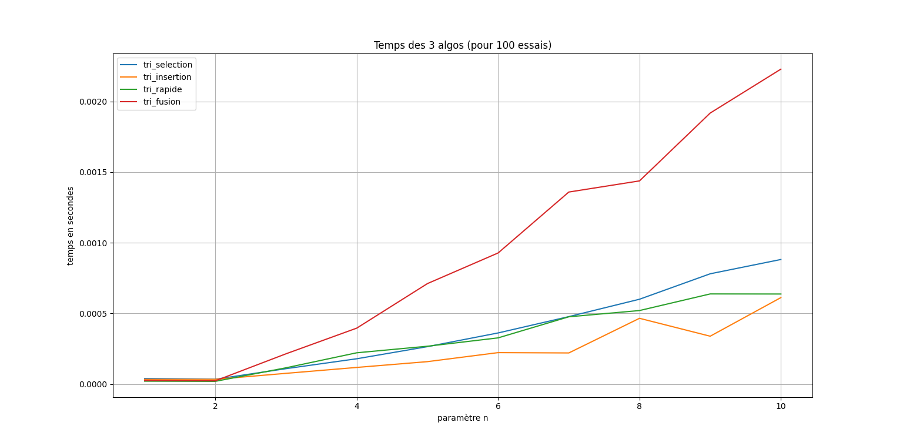
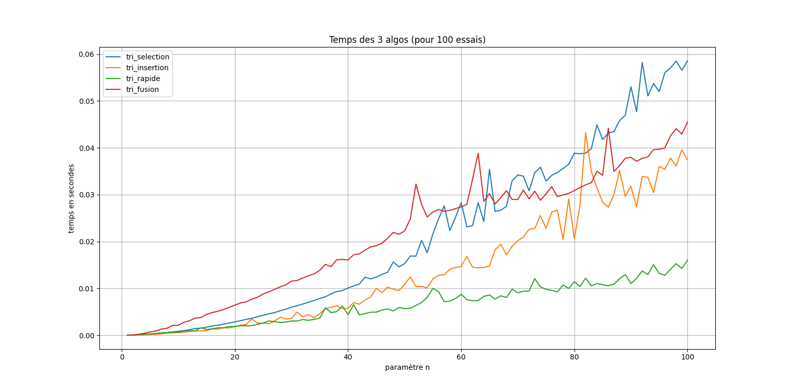
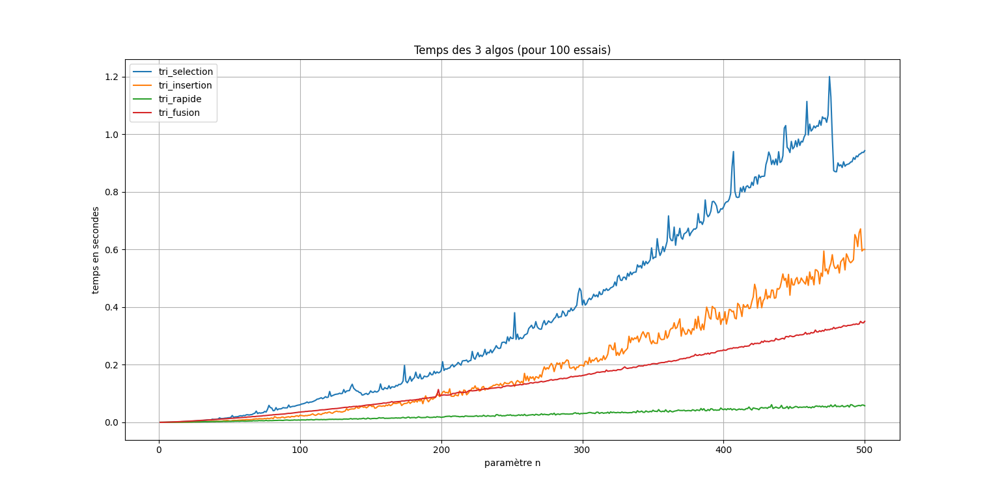

#  **Analyse Qualitative et Quantitative des Algorithmes de Tri**
___
**Auteur :**  
**Delrue Antoine**  

**Date :** 23 Septembre 2024  

___

## **Table des Matières**
1. [**Introduction**](#introduction)
2. [**Méthodologie**](#méthodologie)
3. [**Résultats**](#résultats)  
   - [**Analyse Quantitative**](#analyse-quantitative)  
   - [**Analyse Qualitative**](#analyse-qualitative)
4. [**Conclusion**](#conclusion)

___

## 1. **Introduction**

Dans cette analyse, nous allons examiner  **cinq algorithmes de tri** :

- **Tri par Sélection**
- **Tri par Insertion**
- **Tri rapide**
- **Tri par fusion**
- **Tri sort (tri de python)** (utilisant la fonction `sorted`)

L'objectif est de comparer ces algorithmes en termes de performance.

___

## 2. **Méthodologie**

Pour évaluer les performances, j'ai généré des listes de nombres aléatoires et avec des ordres définis puis on regarde avec différentes valeurs de n, le temps de chaque algo.

___

## 3. **Résultats**

J'ai mesuré le temps d'exécution de chaque algorithme et modifié le paramètre n de la courbe (10,100,500) pour à chaque fois 100 nb_essais.

# Liste aléatoire

Nombre d'essais = 100 

Taille de la liste (n) = 10 

Taille de la liste (n) = 100

Taille de la liste (n) = 500 

### **Analyse Quantitative**
- **Tri par Sélection** : Le temps d'exécution augmente grandement avec la taille de la liste(sera toujours lent, quel que soit l'ordre de la liste).

- **Tri par Insertion** : Performant pour les "petites listes"(sera excellent pour une liste déjà triée).

- **Tri Rapide** : Une excellente performance pour les "moyennes"/"grandes listes"(sera excellent avec des listes mélangées).

- **Tri par Fusion** : Une performance stable pour les grandes listes(sans grande variation de performance).

- **Tri sort (tri de python)** (utilisant la fonction `sorted`): Tirant parti des optimisations de Python, ce tri est très rapide.

### **Analyse Qualitative**
##### Simplicité : 
- **Tri par Sélection** et **Tri par Insertion** : Ce sont les **plus simples** pour des listes de petite taille.

##### Efficacité : 
- **Tri Rapide** et **Tri par Fusion** : Ce sont les **plus efficaces** pour les grandes listes.

##### Tri pour python : 
- **Tri sort (tri de python)** (utilisant la fonction `sorted`) : Utilise des optimisations avancées de python, ce qui le rend extrêmement efficace, surpassant les implémentations manuelles des autres algorithmes de tri.

___

## **Conclusion**

Le choix de l'algorithme de tri dépend de la taille des données, des exigences de l'application et de l'ordre. Pour des listes de petite taille, les algorithmes de tri par sélection et par insertion sont adaptés, tandis que pour des listes de grande taille, les algorithmes de tri rapide et par fusion sont intéressants. Pour un programme python le **sort** peut être un très bon choix.